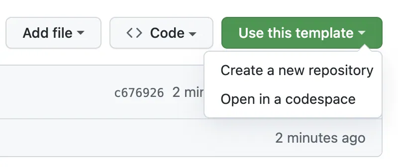
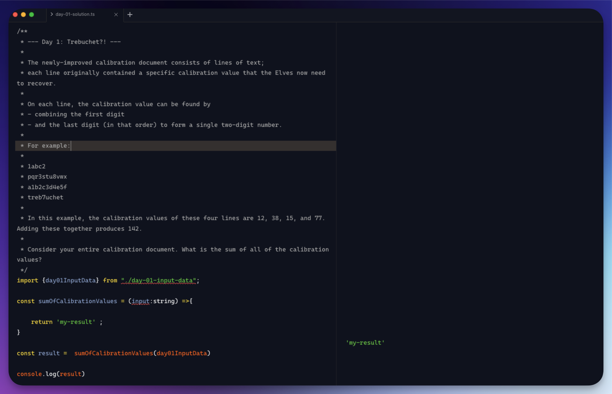

# Advent of Code: TypeScript Project Template

## Introduction

Welcome to the Advent of Code project template! This repository is designed to help you efficiently tackle the challenges presented in the Advent of Code.

## What's Included in This Template?
This template is minimalist, including only Prettier and ESLint. You can format your code before committing with `npm run format` and lint your code with `npm run lint`.

## How to Use?

### Create a Project Using This Template
1. **Click "Use this template":**
At the top of the file list, click the "Use this template" button.

2. **Select "Create a new repository":**


3. **Name Your Repository:**

- Enter a name for your new repository.
- Optionally, add a description and choose whether the repository is public or private.

4. **You're Ready to Go! 🔥**
Name Your Repository:

---
### Solving the Challenges

In the challenges folder, you'll find a file for each day of the challenge. Each day's folder contains two files: an input file and a solution file.

1. **Input File:**

Replace the exported variable with the input data for the challenge you are working on.

```typescript
// 🗒️ challenges/day-02/day-02-input-data.ts

export const day02InputData = "Your input data";
```

2. **Solution File:**

Add the challenge description and use the pre-defined function to solve the challenge. The file includes console logs to assist with debugging.

```typescript
// 🗒️ challenges/day-02/day-02.ts

/**
 * EXERCISE:
 *
 * ==== PART 1 ====
 * * Brief description of the challenge *
 *
 * ==== PART 2 ====
 * * Brief description of the challenge *
 *
 */

import { day02InputData } from "./day-02-input-data";

const method = (day02InputData: string) => {
  console.log({ day02InputData });
  throw Error("Not implemented");
};

const result = method(day02InputData);
console.log({ result });
```

### Debugging

To solve the challenge or debug  your solution you can use [RunJS](https://runjs.app/) since it will allow you to see instantly the output of your code.


